# Crear una imagen personalizada en docker: Nginx

## Página por defecto de Nginx

1. Buscar la imagen en [dockerhub](https://hub.docker.com/). 

2. Si tienes sesión inicia sesión, si no, hay que crear una cuenta.

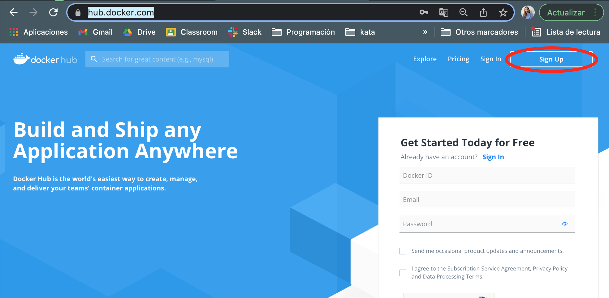
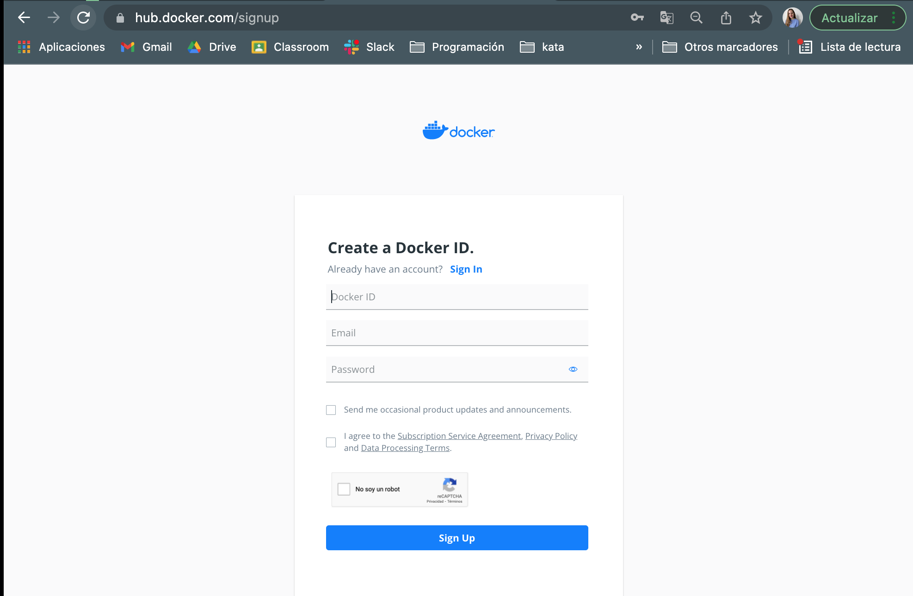

3. Buscar la imagen (ejor si es la original), clicamos y entramos a la información de la imagen. 

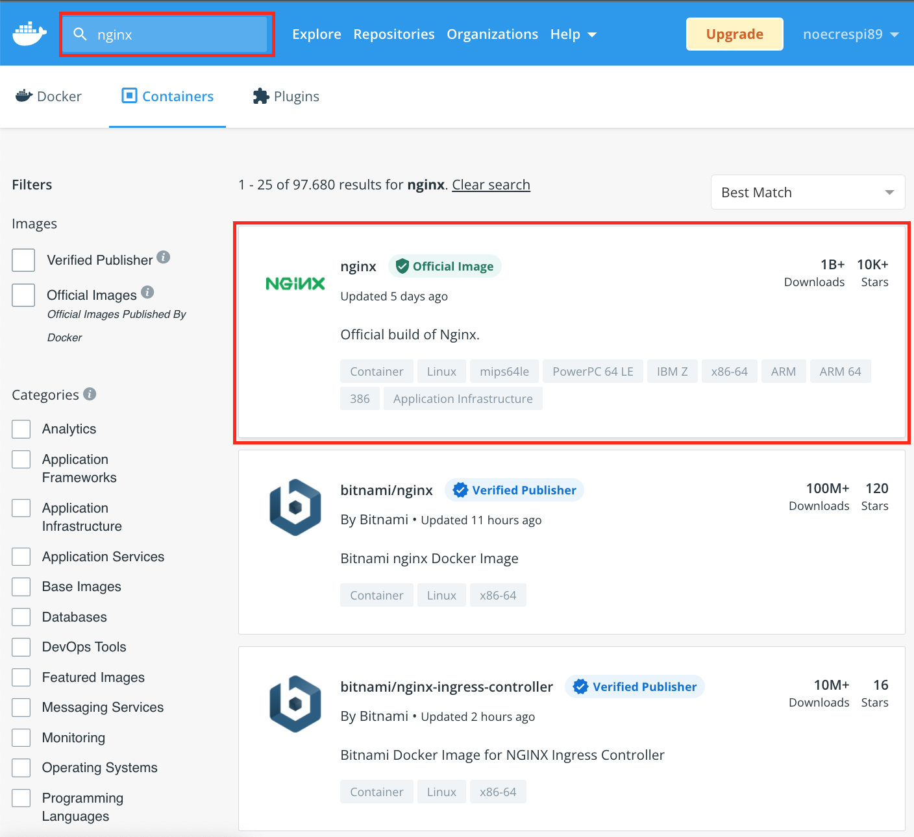

4. Copiar la parte que pone *Copy and paste to pull this image*

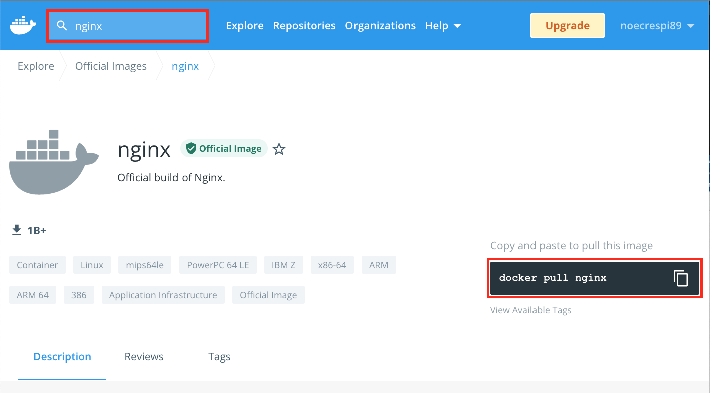

5. Abrir la terminal.

6. Ejecutar. Con esto se descargará y se guardará en el caché de docker.

```
docker run --rm -d -p 8080:80 --name web nginx
```

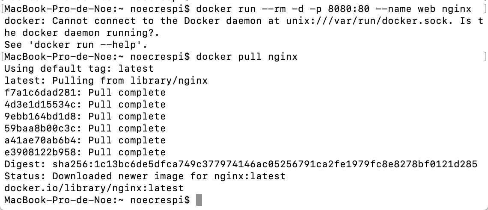

7. Comprobar que el contenedor se ha ejecutado bien en el http://localhost:8080 

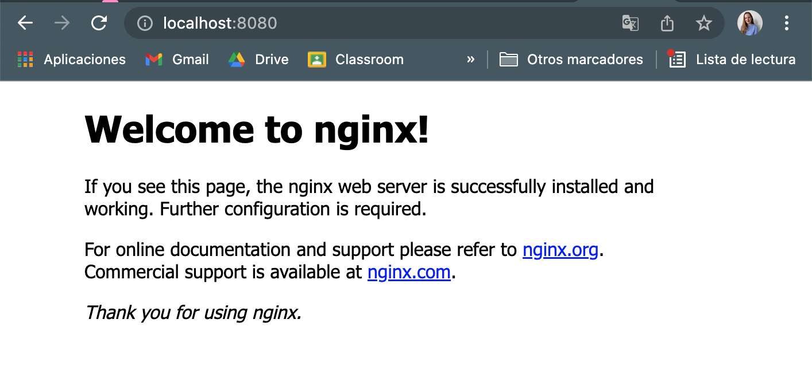

## Página con html personalizado

1. Preparar el directorio donde queremos crear.

En nuestro caso crearemos un directorio 

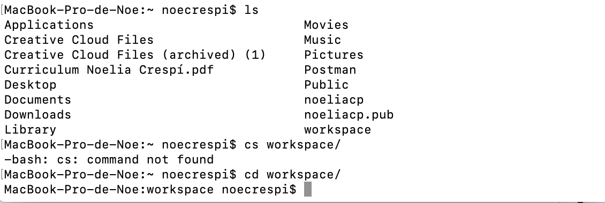
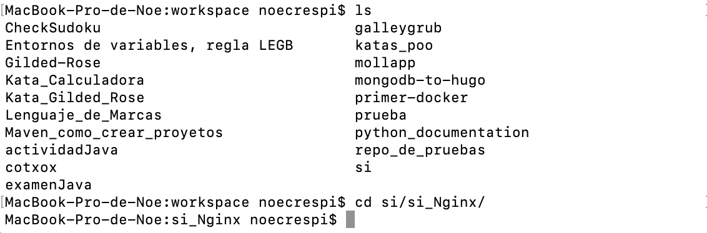
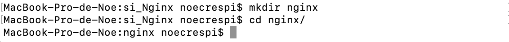
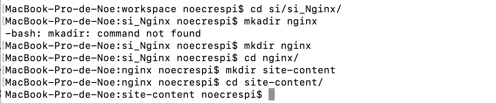
En esta carpeta estará en el `Dockerfile` . 

2. Creamos una carpeta de `site-content` donde estará el archivo `index.html`o `nombre.html` . 

Ejemplo:

```
<!doctype html>
<html lang="en">
<head>
  <meta charset="utf-8">
  <title>Docker Nginx</title>
</head>
<body>
  <h2>Hello desde Cibeseguridad</h2>
</body>
</html>
``` 
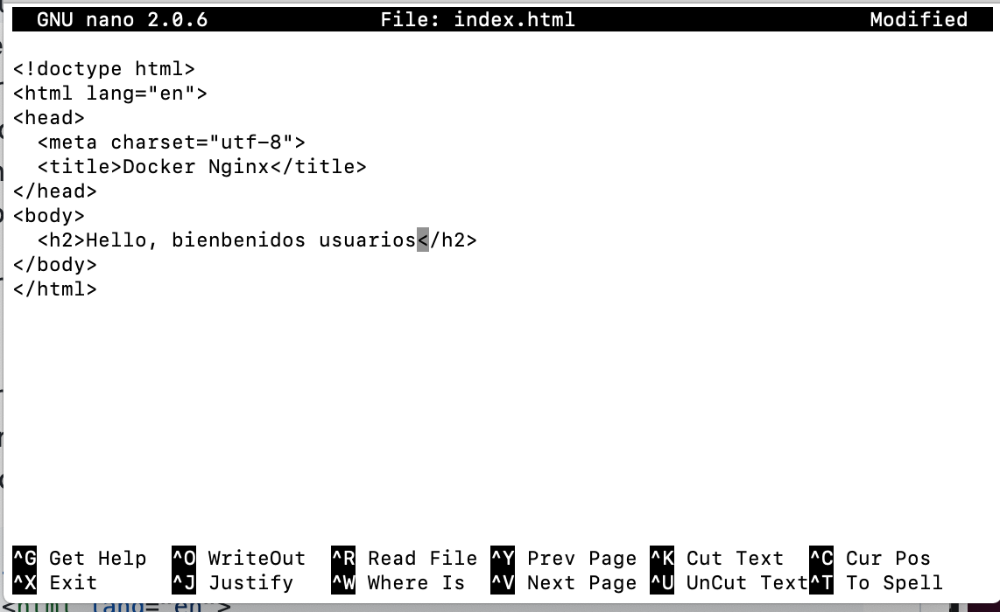


Ejecutar 

```
docker run --rm -d -p 8080:80 --name web -v ~/Documentos/nginx/site-content:/usr/share/nginx/html nginx
```

Con `-v` se crea un volumen. 
Se montará en el directorio local `~/Documentos/nginx...` localmente en el contenedor que se está ejecutando (`/usr/share/nginx/html`)

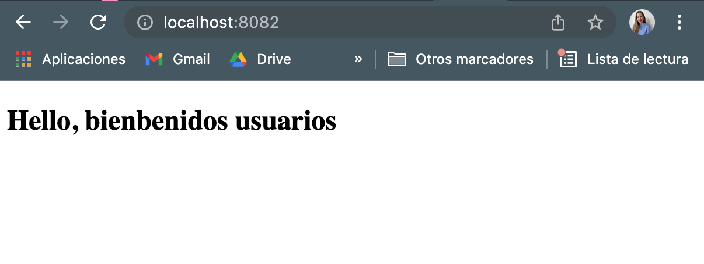

## Crear una imagen personalizada

1. Para crear una imagen personalizada debemos crear un `Dockerfile`. 

Para Windows:
```
FROM nginx:latest
COPY ./site-content/index.html /usr/share/nginx/html/index.html
```

Para Mac:
```
FROM nginx:latest
COPY ./site-content/index.html /usr/share/nginx/html/index.html
```
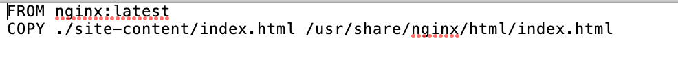

2. Construir la imagen:

```
docker build -t webserver .
```

3. Ejecutar la imagen en un contenedor. En esta ocasión no hay que creat un volumen para incluir el html ya que se hace en el `Dockerfile` al copiar el archivo.

```
docker run --rm -d -p 8080:80 --name web webserver
```
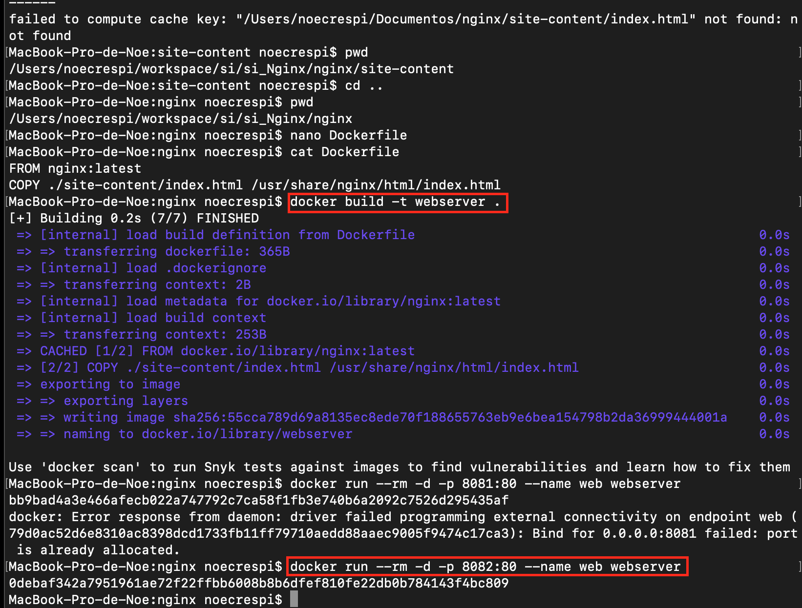


## Comandos a tener en cuenta 

**Para parar el contenedor:**

```
docker stop web
```
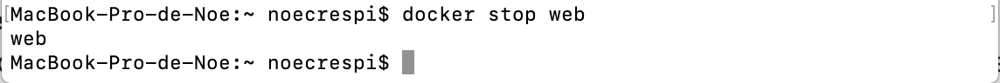

**Editor de texto:**

```
nano index.html
```
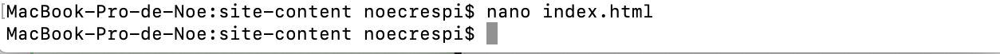


**¿Qué pasa si el puerto está usado?**

- Opción A:
    -  usar un nuevo puerto 

```
docker run --rm -d -p 8080:81 --name web -v ~/Documentos/nginx/site-content:/usr/share/nginx/html nginx
```

- Opción B:

1.  Mirar los tadas las imagenes de docker que estan utilizadas o no:

```
docker ps -a
```

2.  Eliminar las imagenes basura que esta usando el puerto que necesitamos en esta ocasión sera el puerto 80.

3.  Si la imagen está encendiade la tendremos que apagar.

```
docker stop nombreImagen
```

4. Eliminar la imagen. 


```
docker image rm 
```


## ¿Es posible publicar la web de pruebas mediante Microsoft Azure?

si, para ello deberemos crear una máquina virtual los pasos a seguir lo podemos encontrar [aquí](https://docs.google.com/document/d/13vzsd1948ccYS50FjtDKF9dn6-qeVR1Cd3_X9rAe_Zk/edit?usp=sharing). Una vez creada seguiremos los siguientes pasos:

1. Entrar en la máquina virtual el cual queremos conecetar el docker. 

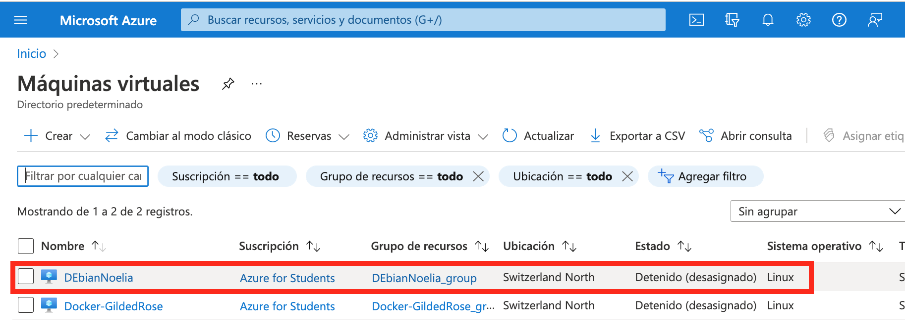

2. Clicar en `rede`s` (se ubica elado izquierdo del menú). 

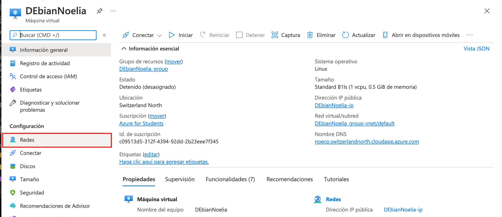

3. Clicar en el botón azul que pone `Agregar regla de puerto de entrada `.

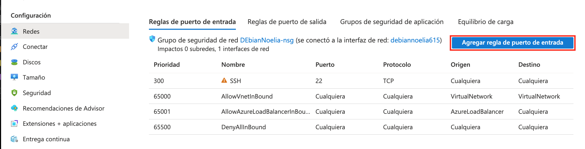

4. Rellenar los campos. En este caso tendremos que solo cambiar el `Servicio` y poner `HTTP`. 

5. Clicar en `Agregar`. 

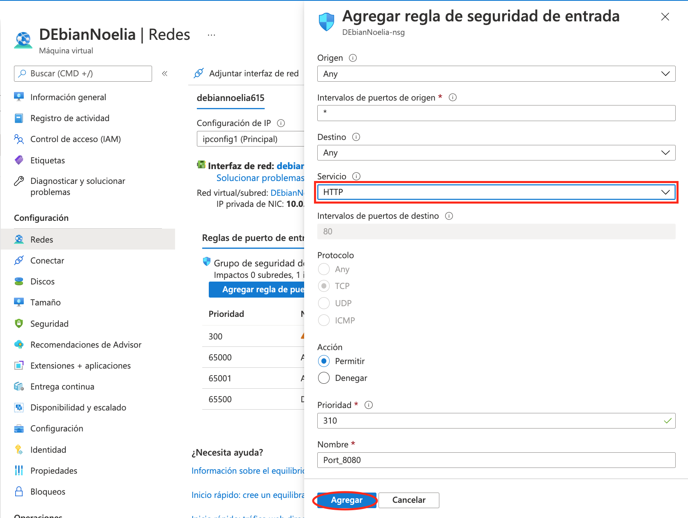

Se ha añadido con éxito.

